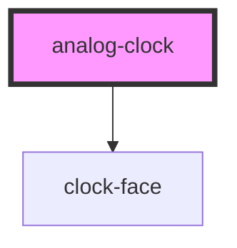

# analog-clock

<!-- Auto Generated Below -->

## Properties

| Property   | Attribute   | Description | Type     | Default |
| ---------- | ----------- | ----------- | -------- | ------- |
| `timeZone` | `time-zone` |             | `number` | `0`     |

## Dependencies

### Depends on

- [clock-face](../clock-face)

### Graph

----------------------------------------------

*Built with [StencilJS](https://stenciljs.com/)*
