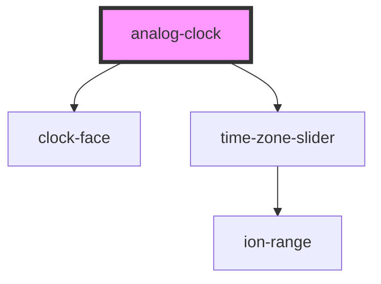

# analog-clock

<!-- Auto Generated Below -->

## Properties

| Property   | Attribute  | Description | Type      | Default     |
| ---------- | ---------- | ----------- | --------- | ----------- |
| `timezone` | `timezone` |             | `boolean` | `undefined` |

## Dependencies

### Depends on

- [clock-face](../clock-face)
- [time-zone-slider](../time-zone-slider)

### Graph

----------------------------------------------

*Built with [StencilJS](https://stenciljs.com/)*
