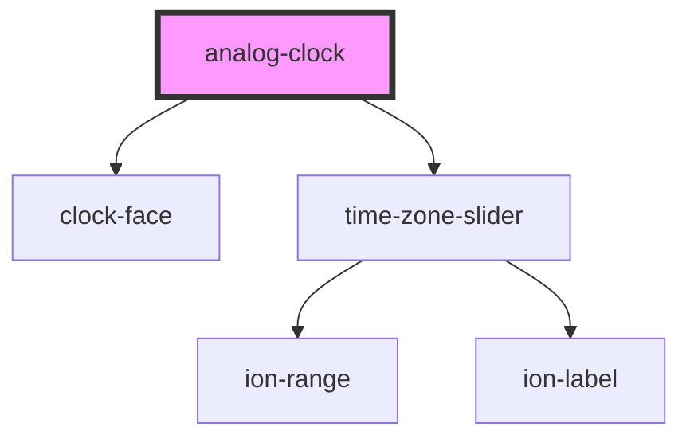

# analog-clock

<!-- Auto Generated Below -->

## Dependencies

### Depends on

- [clock-face](../clock-face)
- [time-zone-slider](../time-zone-slider)

### Graph

----------------------------------------------

*Built with [StencilJS](https://stenciljs.com/)*
