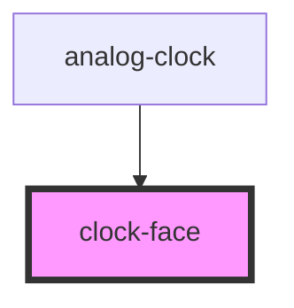

# clock-face

<!-- Auto Generated Below -->

## Properties

| Property | Attribute | Description | Type     | Default     |
| -------- | --------- | ----------- | -------- | ----------- |
| `hour`   | `hour`    |             | `number` | `undefined` |
| `minute` | `minute`  |             | `number` | `undefined` |
| `second` | `second`  |             | `number` | `undefined` |

## Dependencies

### Used by

 - [analog-clock](../analog-clock)

### Graph

----------------------------------------------

*Built with [StencilJS](https://stenciljs.com/)*
