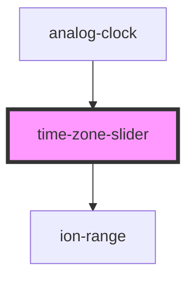

# time-zone-slider

<!-- Auto Generated Below -->

## Properties

| Property | Attribute | Description | Type     | Default     |
| -------- | --------- | ----------- | -------- | ----------- |
| `offset` | `offset`  |             | `number` | `undefined` |

## Events

| Event             | Description | Type               |
| ----------------- | ----------- | ------------------ |
| `timeZoneChanged` |             | `CustomEvent<any>` |

## Dependencies

### Used by

 - [analog-clock](../analog-clock)

### Depends on

- ion-range

### Graph

----------------------------------------------

*Built with [StencilJS](https://stenciljs.com/)*
